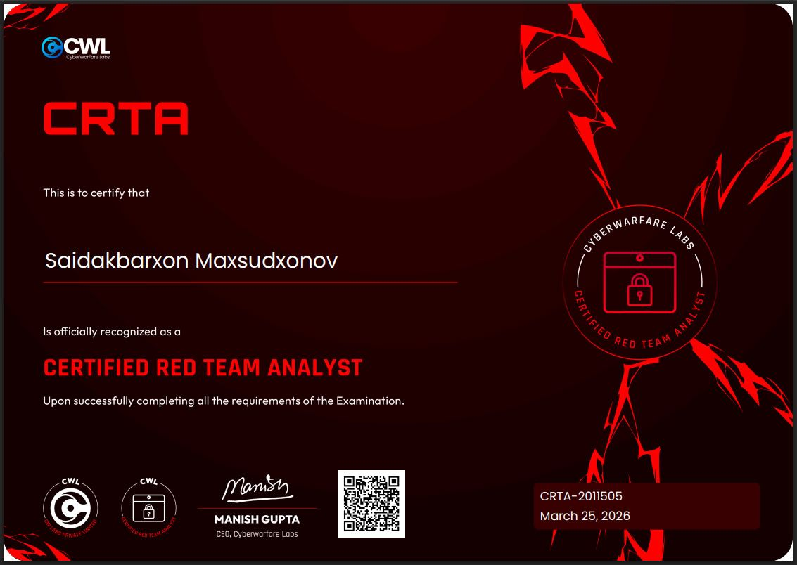
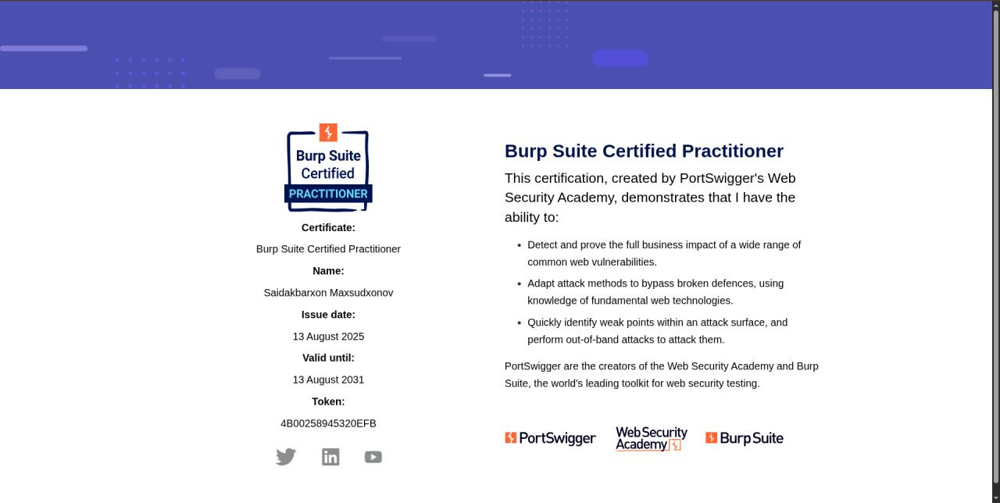
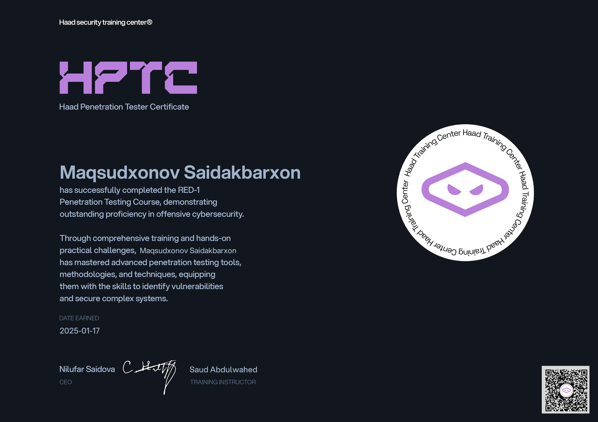

# My-Certificates

  
  


Short, interactive portfolio of my hands-on red team and offensive security certifications.  
All certificate files live in this repository.

---

## Quick links
- HTB ProLabs: https://app.hackthebox.com/prolabs
- CRTA (Red Team Analyst): https://cyberwarfare.live/product/red-team-analyst-crta/
- PortSwigger Web Advanced (BSCP): https://portswigger.net/web-security

---

## Badges
[](https://app.hackthebox.com/prolabs)  
[](https://cyberwarfare.live/product/red-team-analyst-crta/)  
[](https://portswigger.net/web-security)  
[]()

---

## Certificates table
| Issuer | Certificate / Proof | File (click to open) |
|---|---|---:|
| Hack The Box | ProLabs (hands-on) | `HTB/ProLabs.pdf` |
| CyberWarfare.Live | CRTA (Red Team Analyst) | `CRTA/CRTA.pdf` |
| PortSwigger | BSCP (Web Advanced) | `BSCP/BSCP.png` |
| Cloud | Cloud pentest certificate | `Cloud/*.pdf` |
| Various | Other cert files (pdf/jpg/png) | See repo root files |

---

<details>
<summary>Core skills (click to expand)</summary>

- Enumeration  
  - Network, host, web, and Active Directory.

- Situational awareness  
  - Target mapping and operational context.

- Exploitation & chaining  
  - FreeBSD and multi-step exploit chains.

- Web application attacks  
  - Manual testing, automation, and source review.

- Active Directory  
  - AD enumeration, Kerberos attacks, credential abuse, lateral movement.

- Lateral movement & pivoting  
  - Network pivoting, persistence, post-exploitation.

- Privilege escalation  
  - Local and domain escalation techniques.

- Out-of-band exfiltration  
  - Covert channels and data exfiltration techniques.

</details>

---

## Certificate gallery
Click the thumbnail or filename to view the certificate file.

| Thumbnail | Filename |
|---:|:---|
| [](APTLabs.pdf) | [APTLabs.pdf](APTLabs.pdf) |
| [](Ascension.pdf) | [Ascension.pdf](Ascension.pdf) |
| [](CRTA.jpeg) | [CRTA.jpeg](CRTA.jpeg) |
| [](BSCP.jpeg) | [BSCP.jpeg](BSCP.jpeg) |
| [](HTCB.jpg) | [HTCB.jpg](HTCB.jpg) |
| [](Maqsudxonov%20Saidakbarxon_certificate.jpg) | [Maqsudxonov Saidakbarxon_certificate.jpg](Maqsudxonov%20Saidakbarxon_certificate.jpg) |
| [](Zephyr.pdf) | [Zephyr.pdf](Zephyr.pdf) |

If a thumbnail does not render, open the file directly via the filename link.

---

## How to verify
- Open file in this repo to view the certificate image or PDF.  
- Verify issuer via the links above.  
- Use HTB ProLabs and CRTA pages to cross-check claims.

---

## How you can use this repo
- Browse files directly on GitHub.  
- Click thumbnails to view certificates.  
- Clone locally for offline proof.

```bash
git clone git@github.com:sermikr0/My-Certificate.git
